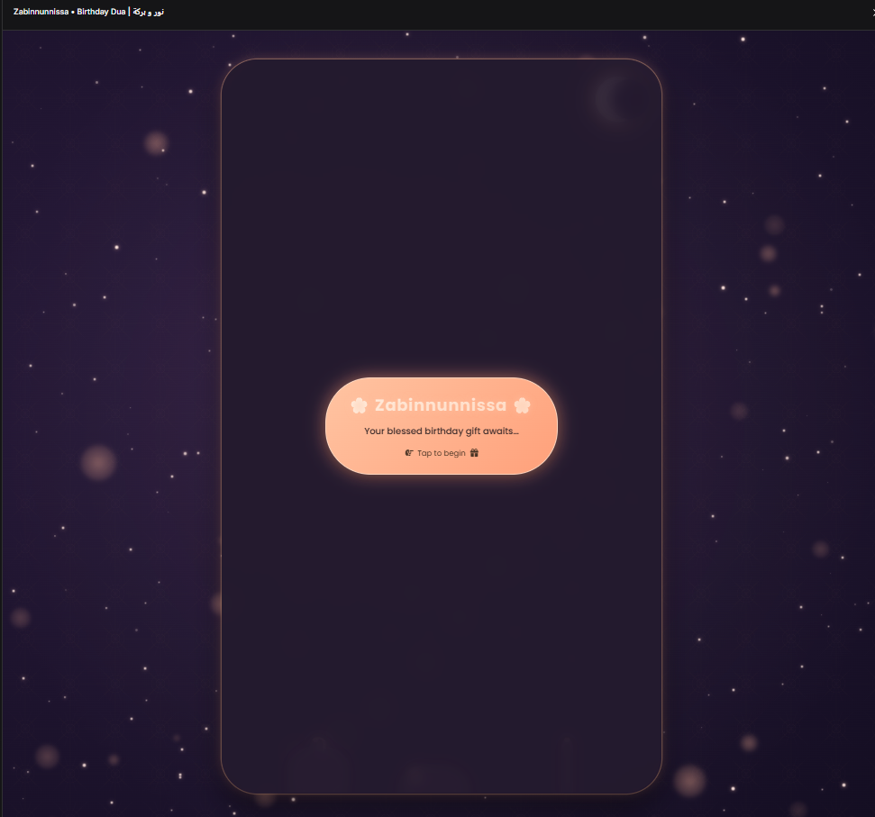
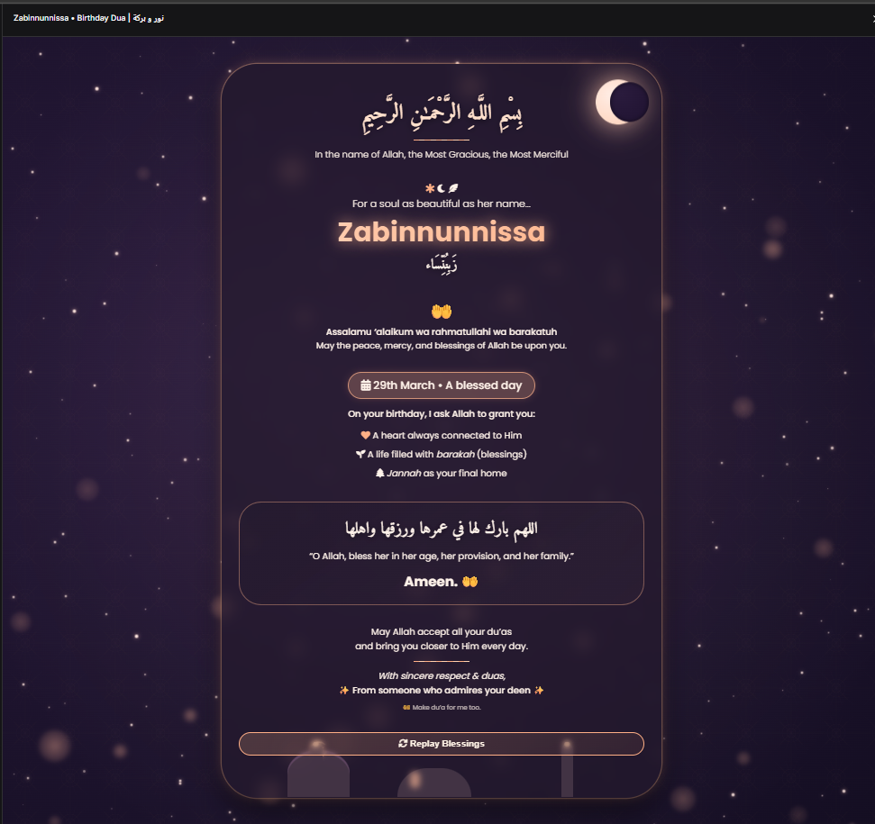

# 🌸 Zabinnunnissa • Birthday Dua

A beautifully animated, Islamic-inspired birthday greeting card for a beloved Muslim sister.  
It combines elegant visuals, gentle animations, and MaherZain to create a heartfelt and respectful experience.

  
  
*Replace with an actual screenshot of your card*

---

## ✨ Features

- 🌙 **Cinematic Islamic Theme**  
  Crescent moon, mosque silhouette, golden geometric patterns, and a starry night sky.

- 🎬 **Auto‑Play Sequence**  
  Six scenes gradually appear with smooth transitions, each with a meaningful dua (prayer) and birthday message.

- 📱 **Responsive & Mobile‑Friendly**  
  Automatically scrolls to each scene on mobile devices, ensuring every message is visible.

- 🎵 **Vocal‑Only Nasheed**  
  The traditional nasheed *“Tala‘al Badru ‘Alayna”* plays from the 3‑second mark, looped.  
  (No musical instruments, staying within Islamic preferences.)

- ✨ **Magical Flower Burst**  
  When the start button is clicked, a shower of soft‑colored flower icons (🌸🌺🌼🌷) bursts from the button, creating a celebratory moment.

- 🌠 **Dynamic Animations**  
  - Twinkling stars  
  - Shooting stars falling naturally  
  - Floating *nur* (light) particles  
  - Pulsing moon glow  
  - Rotating mosque dome finial

- 🎮 **Replay Button**  
  Restart the scene sequence and reset the nasheed to the 3‑second mark.

- 🎨 **Elegant Color Palette**  
  Rose gold, soft mauve, dusty pink, and warm gold – feminine and attractive.

---

## 🚀 How to Use

1. **Download** the `index.html` file (or copy the code).
2. **Open** it in any modern web browser (Chrome, Firefox, Safari, Edge).
3. **Click the start button** to begin the experience.  
   - Flower petals will burst from the button.  
   - The nasheed will start playing (from 0:03).  
   - Scenes will appear one by one with automatic smooth scrolling.

4. **Enjoy** the dua and birthday wishes.

---

## 🛠 Customization

### Changing the Name
The name “Zabinnunnissa” appears in:
- The start button
- The second scene
- The Arabic transliteration

Search for `Zabinnunnissa` in the code and replace it with any name you wish.

### Changing the audio
The audio source is currently:
```html
<source src="./greething_audio.mp3" type="audio/mpeg">
```
## 🎨Adjusting Colors
The main colors are defined in the CSS:

- Background: #2a1b3d (purple) → #140e22

- Gold/rose gold accents: #ffb086, #ffc4a2, etc.

- Modify these to suit your taste.

## ⏱️Scene Timing
Each scene stays visible for 2600 milliseconds (2.6 seconds). To change, edit the `setTimeout` inside `playSequence()`:

```javascript
timer = setTimeout(playSequence, 2600); // change this value
```
## 💐Flower Burst
- Number of petals: petalCount = 45

- Flower icons: modify the flowerIcons array.

- Animation duration: 1.2s (adjust flowerFall keyframes).

## 📁 File Structure
```text
.
└── index.html
└──scripts.js
└──styles.css
└──greething_audio.mp4
```


## 🎵 Music Credit
The “MaherZain” is sourced from the root folder and is used under its free content license.

## 🤝 Contributing
This project was created for a specific personal greeting, but if you have ideas to improve it for others, feel free to open an issue or pull request.

## 📄 License
This project is open source and available under the MIT License.
You are free to use, modify, and share it for personal or non‑commercial purposes.

## 💖 Acknowledgments
- Designed with love for Zabinnunnissa on her blessed day.

- Inspired by Islamic art, dua, and the beauty of nature.

- Fonts: Google Fonts (Amiri, Poppins).

- Icons: Font Awesome 6.

### May this greeting bring joy and barakah. 🤲

Tap the start button to begin your journey of blessings.
